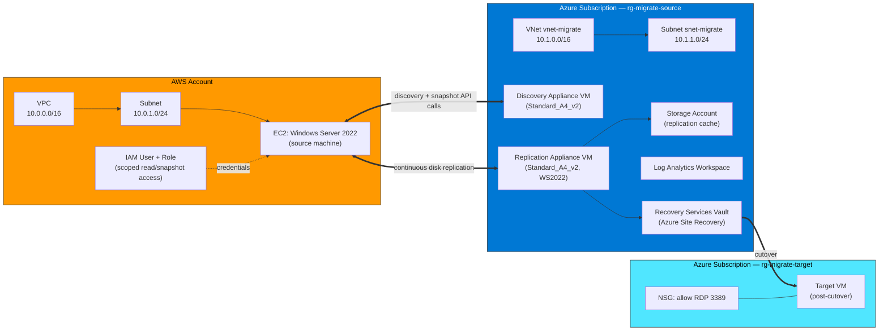
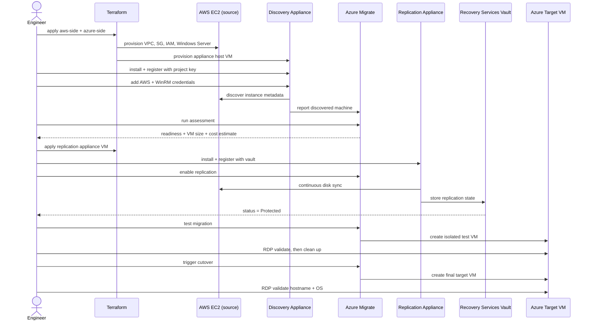

# Azure Migration Lab: AWS EC2 → Azure using Azure Migrate


[Azure Migrate Part 1 video](https://www.youtube.com/watch?v=EOcLbz0TTE8)

[Azure Migrate Part 2 video](https://www.youtube.com/watch?v=Yut7uVWyHkk)

[Azure Migrate Part 3 video](https://www.youtube.com/watch?v=nojcI_829zU)

A hands-on, end-to-end cloud-to-cloud migration: a Windows Server VM is stood up on **AWS EC2**, discovered and assessed by **Azure Migrate**, replicated block-by-block into **Azure**, and cut over to a live Azure VM — with every step provisioned as code and validated by RDP.

> **Interview one-liner:** *"I performed an end-to-end cloud migration from AWS to Azure using Azure Migrate — discovery, assessment, agentless replication, and cutover — and can walk through the decisions made at every stage."*

---

## Table of Contents

- [What This Lab Demonstrates](#what-this-lab-demonstrates)
- [Architecture](#architecture)
- [Migration Flow](#migration-flow)
- [Repository Structure](#repository-structure)
- [Cost Estimate](#cost-estimate)
- [Prerequisites](#prerequisites)
- [How to Run This Lab](#how-to-run-this-lab)
- [Verification Checklist](#verification-checklist)
- [Troubleshooting](#troubleshooting)
- [Teardown](#teardown)
- [Key Concepts](#key-concepts)
- [License](#license)

---

## What This Lab Demonstrates

Cloud-to-cloud migrations are one of the highest-value, most common engagements in cloud engineering — companies move workloads for cost, compliance, consolidation, or M&A reasons. This lab reproduces a real AWS → Azure migration using **Azure Migrate**, Microsoft's native migration service, covering:

| Phase | What Happens |
|---|---|
| **Discovery** | An Azure-hosted appliance reads EC2 instance metadata and disk info via the AWS API |
| **Assessment** | Azure Migrate checks Azure readiness and recommends a target VM size/cost |
| **Replication** | A second appliance continuously syncs disk changes from AWS to Azure (Azure Site Recovery under the hood) |
| **Test Migration** | A throwaway copy of the VM is booted in isolation to validate before commit |
| **Cutover** | Azure creates the final target VM from the latest replicated disk |

All networking, compute, IAM, and storage resources on **both** clouds are provisioned with **Terraform** — the only manual/portal steps are the two Azure Migrate appliances, which require interactive registration and therefore cannot be fully expressed as code.

---

## Architecture



**Key design decisions:**
- AWS VPC (`10.0.0.0/16`) and Azure VNet (`10.1.0.0/16`) use non-overlapping ranges in case VPN/peering is added later.
- Two **separate** Azure appliance VMs are required for AWS/physical sources: a **discovery appliance** (inventory + assessment) and a **replication appliance** / Configuration Server (disk-level sync via Azure Site Recovery). This differs from VMware migrations, which only need one.
- Source and target resource groups in Azure are kept separate so migration infrastructure can be torn down without touching the newly migrated VM.

---

## Migration Flow



---

## Repository Structure

```
aws-to-azure-migrate/
├── aws-side/
│   ├── main.tf          # VPC, subnet, SG, IAM role/user, EC2 Windows instance
│   ├── variables.tf      # region, instance size, AMI, admin password
│   ├── outputs.tf         # public IP, instance ID, Migrate service account keys
│   └── terraform.tfvars   # environment-specific values (gitignored — see note below)
│
├── azure-side/
│   ├── main.tf          # RGs, VNet, storage, Log Analytics, Recovery Services Vault,
│   │                      appliance + replication VMs, target NSG
│   ├── variables.tf
│   ├── outputs.tf
│   └── terraform.tfvars
│
└── README.md
```

> ⚠️ **Do not commit `terraform.tfvars` or any `.tfstate` file** — both contain plaintext admin passwords and AWS access keys. Add them to `.gitignore` before pushing this repo.

```gitignore
*.tfvars
*.tfstate
*.tfstate.backup
.terraform/
```

---

## Cost Estimate

| Resource | Estimated Cost |
|---|---|
| EC2 `t3.medium` (Windows) | ~$0.08/hr (~$0.50 for 6 hrs) |
| Azure Migrate appliance VM (`Standard_A4_v2`) | ~$0.40/hr |
| Azure replication appliance VM (`Standard_A4_v2`) | ~$0.40/hr |
| Azure Storage (replication cache, ~30GB) | ~$0.60/day |
| Azure target VM (`Standard_B2s`, post-cutover) | ~$0.05/hr |
| **Total for a full-day lab** | **~$5–8** |

**Destroy all resources immediately after the lab** — see [Teardown](#teardown).

---

## Prerequisites

### Accounts
- AWS account with programmatic access
- Azure subscription with Contributor access

### AWS IAM Setup (for Terraform)
1. IAM → Users → Create user `terraform-migrate-lab`
2. Attach `AmazonEC2FullAccess` and `AmazonVPCFullAccess`
3. Generate and save an access key pair

### Local Tooling

| Tool | macOS | Windows |
|---|---|---|
| Terraform | `brew install hashicorp/tap/terraform` | [Download](https://developer.hashicorp.com/terraform/downloads) |
| AWS CLI | `brew install awscli` | [Download](https://aws.amazon.com/cli/) |
| Azure CLI | `brew install azure-cli` | [Download](https://aka.ms/installazurecliwindows) |

Authenticate both CLIs:

```bash
aws configure                 # access key, secret, region (us-east-1), json output
az login
az account set --subscription "Azure subscription 1"
```

Verify:

```bash
aws sts get-caller-identity
az account show
```

Both must return account info with no errors before continuing.

---

## How to Run This Lab

This README summarizes the workflow. **The full step-by-step build guide — including every Terraform resource, every portal click, and the reasoning behind each configuration choice — lives in [`LAB_GUIDE.md`](./LAB_GUIDE.md).**

**High-level sequence:**

1. **Part 1 — AWS source environment**: `terraform apply` in `aws-side/` to create the VPC, security group, IAM role/user, and the source Windows Server EC2 instance.
2. **Part 2 — Azure target environment**: `terraform apply` in `azure-side/` to create resource groups, VNet, storage account, Log Analytics workspace, and Recovery Services Vault.
3. **Part 3 — Discovery appliance**: Create the Azure Migrate project and discovery appliance in the portal (manual — not supported by the `azurerm` Terraform provider), provision its host VM via Terraform, install and register it, then add AWS + WinRM credentials and run discovery.
4. **Part 4 — Assessment**: Run an Azure VM assessment against the discovered EC2 instance and review readiness, sizing, and cost.
5. **Part 5 — Replication**: Provision and register the replication appliance (Configuration Server), enable replication, and wait for status to reach `Protected`.
6. **Part 6 — Test migration & cutover**: Run a test migration in an isolated network to validate, clean it up, then trigger the real cutover and verify the final VM by RDP.

```bash
# AWS side
cd aws-side
terraform init && terraform plan && terraform apply

# Azure side
cd ../azure-side
terraform init && terraform plan && terraform apply
```

---

## Verification Checklist

- [ ] EC2 instance visible and running in the AWS console
- [ ] Azure Migrate project exists with appliance registered
- [ ] EC2 instance appears in the discovered machines list
- [ ] Assessment shows **Ready for Azure**
- [ ] Replication status reaches **Protected**
- [ ] Test migration succeeded and was cleaned up
- [ ] Cutover triggered and the migrated VM appears in the target resource group
- [ ] RDP to the migrated VM succeeds with the original credentials
- [ ] Migrated VM hostname and OS version match the source EC2 instance

---

## Troubleshooting

| Symptom | Likely Cause | Fix |
|---|---|---|
| EC2 instance not discovered | Wrong AWS credentials in appliance | Re-enter access key/secret in the appliance config manager |
| Discovery shows 0 machines | Region mismatch | Confirm the appliance's configured region matches the EC2 instance's region |
| Replication stuck at 0% | Storage account not reachable | Confirm `stmigrate<name>` is in the same subscription/region as the Migrate project |
| Assessment shows "Not ready" | Unsupported OS version | Use Windows Server 2012 R2+ (2022 always passes) |
| RDP to migrated VM fails | NSG not attached | Attach `nsg-migrate-target-<name>` to the target VM's NIC |
| Cutover VM has a different IP | Expected — DHCP assigns a new Azure IP | Update DNS records if applicable |
| Terraform: invalid name (`sg-` prefix) | AWS reserves `sg-` for system-generated SG IDs | Rename to something like `migrate-source-sg-<name>` |
| Terraform: empty result creating instance | Invalid AMI ID for region | Look up the current Windows Server 2022 AMI via `aws ec2 describe-images` and update `terraform.tfvars` |
| Terraform: `azurerm_migrate_project` invalid resource type | Not supported by the `azurerm` provider | Replace with a `null_resource` placeholder; create the project manually in the portal |

Full root-cause explanations for each error are documented in [`LAB_GUIDE.md`](./LAB_GUIDE.md#troubleshooting).

---

## Teardown

**Order matters** — destroy in this sequence to avoid dependency errors:

1. Stop replication in the Azure Migrate portal (**Replicating machines → Stop replication**)
2. `terraform destroy` in `aws-side/`
3. Delete the discovery appliance VM (provisioned outside core Terraform state if built via CLI)
4. `terraform destroy` in `azure-side/`
5. Delete the target resource group: `az group delete --name rg-migrate-target-<name> --yes`

> If `terraform destroy` fails on the Recovery Services Vault with a *"vault is not empty"* error, manually delete backup/replication items in the portal first, then retry.

---

## Key Concepts

- **Agentless (in this context)** — no agent is installed *on the source EC2 instance*. Azure still requires two orchestration appliances running in Azure itself: one for discovery/assessment, one for replication (Azure Site Recovery under the hood). This is unlike VMware agentless migrations, which need only one appliance.
- **Recovery Services Vault** — the control plane for replication state, policies, and Site Recovery orchestration.
- **Replication cache storage account** — a temporary buffer absorbing disk deltas between sync cycles; disposable if lost, since replication just restarts.
- **Test migration vs. cutover** — test migration spins up an isolated, disposable copy of the VM to validate before committing; cutover is the real, final switch.

---

## License

This lab is provided for educational/portfolio purposes. Adapt freely for your own learning or interview prep.
